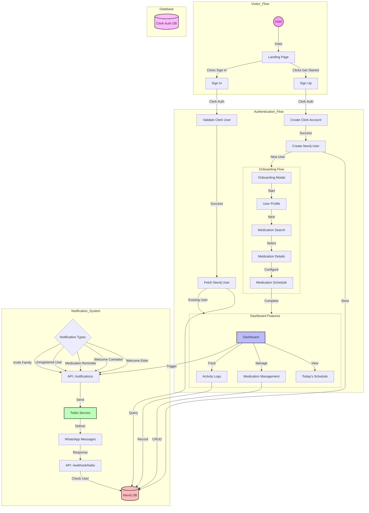

# Application Architecture

## System Overview
This document outlines the architecture of the medical tracking application (Poppa.AI), including all major components and their interactions.

## Installation for Viewing
To view the architecture diagram in VS Code:
1. Install the "Markdown Preview Mermaid Support" extension
2. Open this file in VS Code
3. Press `Ctrl+Shift+V` (Windows/Linux) or `Cmd+Shift+V` (Mac) to open the preview
4. The diagram will render automatically

## Architecture Diagram

## Component Breakdown

### Authentication System
- **Clerk Authentication**: Handles user signup, signin, and session management
- **Neo4j User Store**: Stores user profiles and relationships
- **Auth Flow**: Clerk → Neo4j user creation/validation

### Notification System
- **Types**:
  - Welcome Elder
  - Welcome Caretaker
  - Medication Reminder
  - Unregistered User
  - Invite Family (Two-step)
- **API Endpoints**:
  - `/api/notifications/*`: Handles notification sending
  - `/api/webhook/twilio`: Processes WhatsApp responses
- **Twilio Integration**: WhatsApp message delivery

### Database Structure
- **Clerk DB**: User authentication and sessions
- **Neo4j DB**: 
  - User profiles
  - Medications
  - Schedules
  - Relationships
  - Activity logs

## Key Workflows

1. **Authentication Flow**
   - User signs up/in through Clerk
   - Clerk validates credentials
   - Neo4j user created/fetched
   - Route to onboarding or dashboard

2. **Notification Flow**
   - System triggers notification
   - API formats message
   - Twilio delivers WhatsApp message
   - User responds via WhatsApp
   - Webhook processes response
   - Neo4j records interaction

3. **Medication Management**
   - CRUD operations in Neo4j
   - Schedule tracking
   - Notification triggers
   - Activity logging 